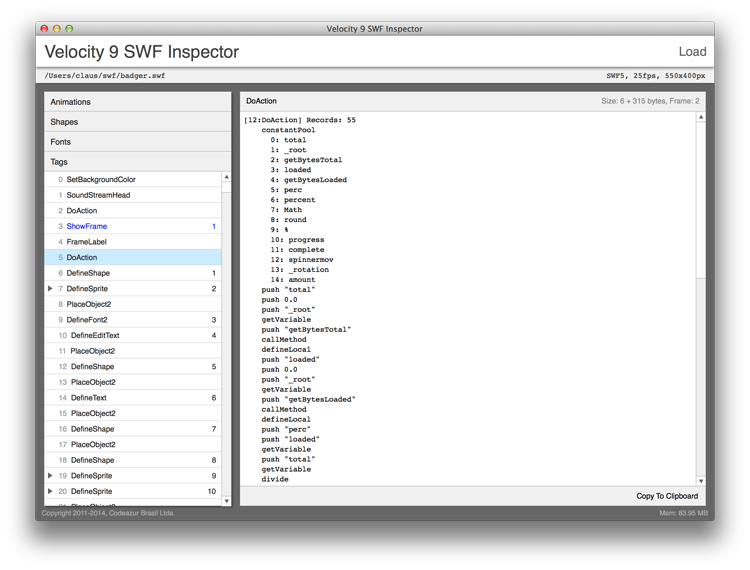
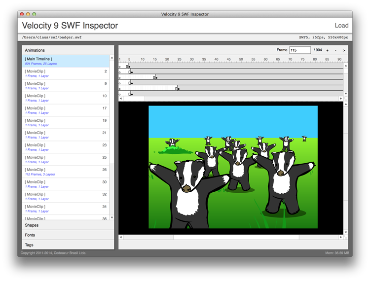
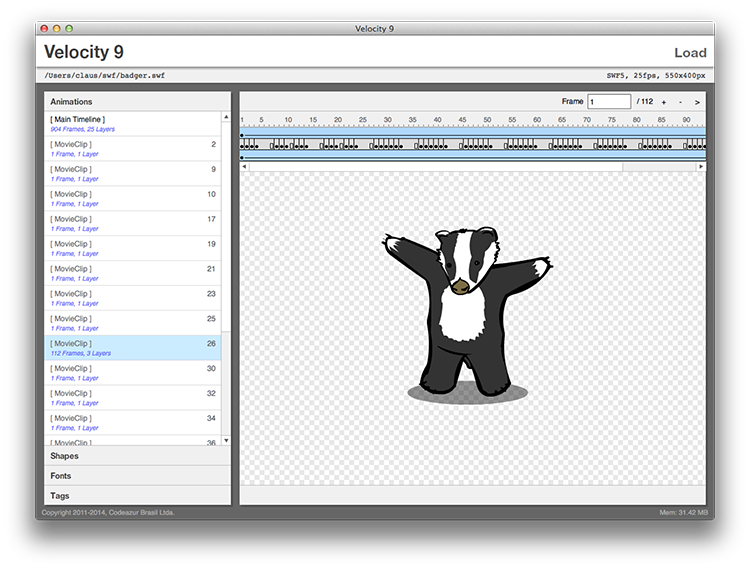
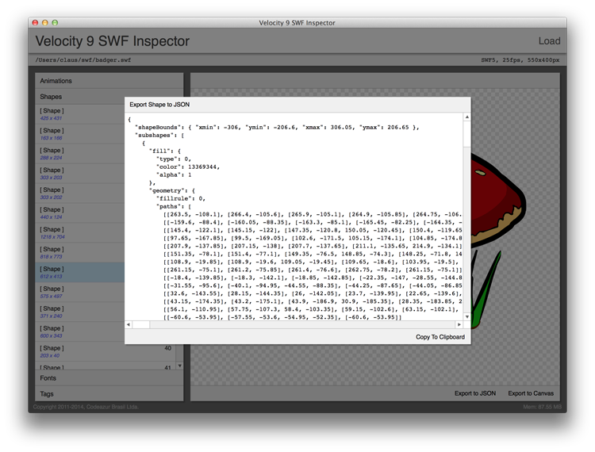

# The Velocity 9 SWF Inspector

A handy little tool to peek inside SWF files.

Very unfinished, but still quite useful.

Download [here](https://github.com/velocity9/Inspector/releases).

You need the [Adobe AIR runtime](https://get.adobe.com/air/).

## Screenshots

A picture is worth a thousand words.

### Tags

### MovieClips

### Shapes

### Shape Export

## TODO

- Animations: fix stage view (positioning on stage, masking etc., make selecting a frame easier/work)
- Shape export: fix and add more targets
- Fonts: display them, add export
- Bitmaps: add export
- Tags: display proper bytecode for DoAction, DoABC etc.
- lots of other, minor stuff
